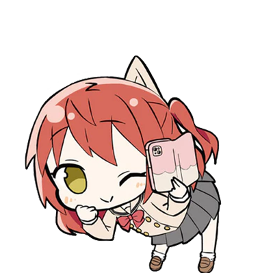
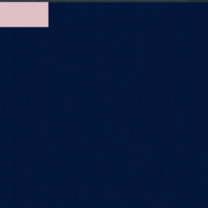
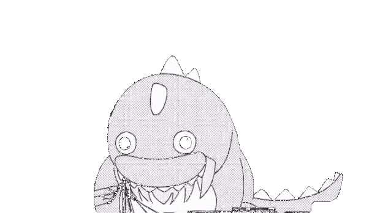

   

<h1> Bocchi! [ぼっち・ざ・ろっく! - Bocchi the Rock!] </h1>

  

## - Preview

<a href = "https://aber1047.github.io/bocchi/">
 

##### (click the image)

</a>

-------------

스팀(steam)에서 판매중인 Wallpapaer engine과 연동됨

Available in 'Wallpapar Engine' (Steam)

#### ▼ 관련해선 요기 참고 (Download link)
https://steamcommunity.com/sharedfiles/filedetails/?id=2902111469

#

 

<a href = "https://github.com/ABER1047/interaction-sticker-website">interaction-sticker-website</a> 소스 개조해다 만든거 ㅇㅇ

Above source was used during making for this function

